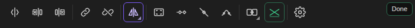

# Edit Tools: a CapCut-style toolbar for Premiere Pro

A slim tool strip you dock next to Premiere's Tools panel. It has 15 one-click editing tools, and every tool can get its own keyboard shortcut. Works in Premiere Pro 2021 through 2026.

## Install

1. Close Premiere Pro.
2. **Windows:** double-click `install_windows.bat`. **Mac:** open Terminal and run `bash install_mac.sh`.
3. Open Premiere and go to **Window → Extensions → Edit Tools**. Drag the panel next to the Tools panel.
   It stacks vertically when narrow and becomes a single row when docked wide.

## Set up the shortcuts (once)

Every tool is also listed in **Window → Extensions** as **Edit Tools: <tool name>**. That's what lets Premiere give it a real keyboard shortcut that works in the Timeline:

1. Open **Edit → Keyboard Shortcuts** (Mac: **Premiere Pro → Keyboard Shortcuts**).
2. Type **Edit Tools** in the search box.
3. Click in the shortcut column of each row and press the key from this table.

The suggested keys are all **Alt+Shift** (Mac **⌥⇧**) plus a letter. Premiere's default layout leaves that range empty, and the shortcut editor warns you if one clashes with a key you've customised.

| Tool | Key | What it does |
|---|---|---|
| Split | Alt+Shift+B | Cuts the selected clips (or every clip under the playhead) at the playhead |
| Delete Left | Alt+Shift+Q | Removes the part of the clip before the playhead, then ripples the rest back so it butts up against the previous clip |
| Delete Right | Alt+Shift+W | Removes the part after the playhead and ripples the next clip back to the playhead |
| Link | Alt+Shift+L | Select many videos and audios: each video is linked only to the audio lined up exactly under it (same source first) |
| Unlink | Alt+Shift+U | Unlinks the selected clip |
| Freeze | Alt+Shift+F | Inserts a 3 s freeze frame of the playhead frame and pushes the rest of the edit (all tracks) right |
| Reverse | Alt+Shift+E | Reverses the clip **and its audio**. Press again to un-reverse |
| Mirror | Alt+Shift+M | Flips the clip horizontally. Press again to remove the flip |
| Rotate 90° | Alt+Shift+O | Rotates the clip 90° |
| Fit to Frame | Alt+Shift+I | Scales the clip (up or down, never stretched) so the whole clip fits the sequence frame, and centres it. Right-click the button for **Fill** (covers the frame, crops the edges) |
| Full Keyframes | Alt+Shift+K | Adds a keyframe on the clip's first and last frame for Position, Scale and Rotation |
| Clear Keys | Alt+Shift+X | Removes all keyframes from Position, Scale, Rotation and Speed |
| Speed Ramp Keys | Alt+Shift+R | Turns on Time Remapping speed keyframes at both ends of the clip, ready to ramp |
| Quick Transition | Alt+Shift+T | Applies the last transition you used. Right-click the button to pick another |
| Audio Crossfade | Alt+Shift+C | 2 touching audio clips selected: crossfade. 1 clip: choose fade in, fade out or both |

The purple **Clip Tool** button opens Freeze / Reverse / Mirror / Rotate like CapCut's menu, and shows the last one you used.
Hover any button to see its shortcut. The gear button lists all shortcuts; you can change the labels there, and they also work while the panel is focused.

Delete Left/Right ripple like Premiere's ripple delete. Every unlocked track that is clear across the gap moves with the edit, so B-roll, titles and SFX stay in sync. A track that has something running through the gap, like a music bed, stays where it is.

When a tool acts on "the clip", it uses your selection. If nothing is selected, it uses the top clip under the playhead.

## What Premiere doesn't allow

- **Buttons inside the native Tools panel:** Adobe doesn't let plugins add buttons there, so this is a separate panel you dock beside it.
- **Main track magnet / auto snapping / linked selection toggles:** Premiere gives plugins no way to switch these. The native versions sit at the top-left of the Timeline: **Snap** (`S`) and **Linked Selection**. Premiere has no magnetic main track.
- **Speed Ramp Keys** adds the speed keyframes, but plugins can't switch the clip's display to *Show Clip Keyframes → Time Remapping → Speed*. Do that once from the clip's `fx` badge.
