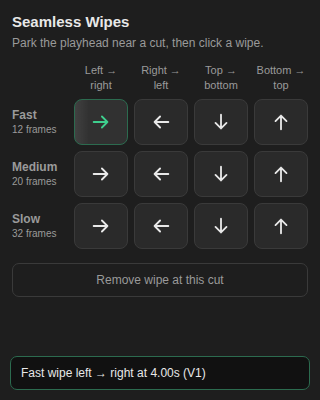

# Seamless Wipes: one-click whip transitions for Premiere Pro

Park the playhead near a cut and click a button. It builds a seamless wipe between the two clips:
**left → right, right → left, top → bottom or bottom → top**, each at **Fast (12 frames), Medium (20) or Slow (32)**.

## Install

1. Close Premiere Pro.
2. **Windows:** double-click `install_windows.bat`. **Mac:** run `bash install_mac.sh` in Terminal.
3. Open Premiere and go to **Window → Extensions → Seamless Wipes**.

## Use

1. Put two clips next to each other on a video track (touching, no gap).
2. Move the playhead near the cut, within 3 seconds. If several tracks have cuts, the top one is used. If you've selected one of the two clips, that cut wins.
3. Click a wipe. Play it back.

**Remove wipe at this cut** takes it off both clips again (or use Ctrl/Cmd+Z).

## How it works

This is the classic "seamless transition" technique, built for you in one click:

- The **outgoing clip** gets an **Offset** effect that slides the picture in the chosen direction, speeding up toward the cut. A **Directional Blur** builds with the speed.
- The **incoming clip** picks up the motion at full speed on the very next frame, then slows to a stop as the blur clears.
- Offset wraps the picture around the frame edges, so no black ever shows and the clips don't need to overlap or have handles.
- There's a keyframe on every frame of one smooth ease-in/ease-out curve, so the speed carries straight through the cut.

To tweak a wipe, open **Effect Controls** on either clip. The keyframes are on *Offset → Shift Center To* and *Directional Blur → Blur Length*.
