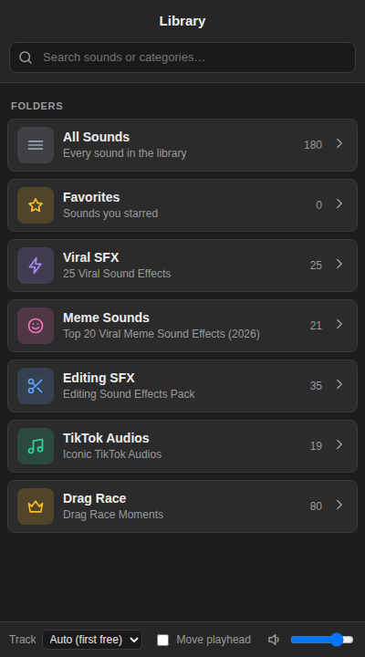

# SFX Library: a Premiere Pro panel

A panel for Premiere Pro 2026 (it also works back to 2021). It holds **181 sound effects and meme audios** sliced from 5 source videos, sorted into folders. You can search them, preview them, and press **Apply** to drop one onto your sequence **at the playhead** in one click.

## Install

1. Download or clone this folder (`premiere-sfx-plugin`).
2. Close Premiere Pro.
3. **Windows:** double-click `install_windows.bat`.  **Mac:** open Terminal and run `bash install_mac.sh`, or drag the file into Terminal and press Enter.
4. Open Premiere Pro, then go to **Window → Extensions → SFX Library**. Dock the panel wherever you like.

The installer copies `SFXLibrary` into Adobe's CEP extensions folder. It also turns on `PlayerDebugMode`, which Premiere needs to load an extension that isn't from the Adobe Exchange.

## Use

- **Folders:** All Sounds, Favorites (star a sound), and one folder per source video.
- **Search:** type a sound name, a category (`drag`, `meme`, `tiktok`…), a tag (`whoosh`, `impact`, `scream`…) or words from the quote (`rigor mortis`). Press `/` to jump to search and `Esc` to clear it.
- **▶** previews the sound. Press it again to stop. The volume slider sits at the bottom.
- **Apply** (or double-click a row) imports the sound into a `SFX Library` bin once. Then it places the sound at the current playhead on the **first audio track that is free** for the sound's full length, so it never overwrites your dialogue or music. If every track is busy, it adds a new audio track.
- **Track** lets you force a specific track (A1–A8). **Move playhead** moves the playhead to the end of the sound after each Apply.

## Adding your own sounds

1. Click **＋** in the top-right corner of the panel.
2. Click **Choose audio files…** and pick one or more files (MP3, WAV, AIFF, M4A, AAC, OGG or FLAC).
3. Rename them if you like, choose a folder (or **＋ New folder…**), and click **Add to library**.

Added sounds are copied into your own library folder, so reinstalling or updating the plugin never removes them:
Windows `%APPDATA%\SFXLibrary`, Mac `~/Library/Application Support/SFXLibrary`.
Sounds you added have a 🗑 button to remove them again.

## Sound list

### Viral SFX (25), from “25 Viral Sound Effects”

Surprised, Click, Bone Crack, Boom, Throw, Woaaaah, Window Break, Whoosh, Slap, Glitch, Clock Ticking, Kids Yeyy, Mario Coin, Surprised 2, Surprised 3, Display Digits, Pop, Discord Join, Game Point, Let's Go, Wrong Answer, Shotgun, Reload, Ding, Help Me

### Meme Sounds (22), from “Top 20 Viral Meme Sound Effects (2026)”

Violin Speech, I've Got This FAAAH, The Undertaker Bell, Vine Boom, Are You Sure - Omni Man, Lego Die, Among Us Role Reveal, A Few Moments Later, Fortnite Death, Disappear Scream, Screaming Emoji, Where Are You Going, SpongeBob Fail, Loading Lost Connection, YEET, Flash Bang, Disappear, Ayo, Apple Pay, Lobotomy, Anime Wow, Ultra Instinct Theme

### Editing SFX (35), from “Editing Sound Effects Pack”

Explosion, Mouse Click, Typing, Clock Ticking, Awwww, Woosh, Faahh, Fart, Baigan, Awkward Crickets, Shocking, Slap, Build Up, Running, Chomp, Fighting, Rewind, Wrong, Transition, Slice, Among Us, Ding, Ghostly, Reload, Shot, Magic, Ehh, Quack, Slap 2, Bruh, Chicken On Tree, Punch, Gop Gop, Camera Shutter, Shocked

### TikTok Audios (19), from “Iconic TikTok Audios”

That's Suspicious, That's Weird, Don't Do It, Oh My God It's Not Funny, Just Because You're Ugly, SpongeBob Spotlight, You Gotta Be Kidding Me, I Wanna Go Home, So She Passed Away, My Eyes Are Correct, Back To The Computer - Aw Man, 4th Of July Firecrackers, Countdown, Just Answer The Question, You Would Do It Too For A Check, Oh My God What Is That, Where's The Flavor, Do The Hokey Pokey, What's Wrong With Your Ashy Ass

### Drag Race (80), from “Drag Race Moments”

Mother Has Arrived, Bye!, Who's After Peppermint, Why Are Y'all Acting Brand New, I'm Known As The Dancing Diva, I Need To Go To The End, Party!, Miss Vanjie, Come Here And Tell Us Honey, What The F, I Saw The Numbers, Brown Cow Stunning, You're So Seductive, Look How Orange You Look, You're Perfect, Everything About You Is Perfect, Hi Maria! What's Up Bitch, Unable To Receive That Information, Quite The USB Port, I Was Motherf-ing Ready, What Does That Have To Do With Anything, What Is The Tea, They Got Me Gal, My Neck!, Hello Up There! Do I Know You, Sequin Gown, RuPaul Hysterical Laughing, That Bitch Is A Goddess, Pants That Have A Stirrup, You F-ing Pussy, You Don't Love Me, I Had Crystallized, Put Your Lighters Up, From Dallas Texas, Free Willy!, You Frump Pig, Penis!, Tiny Little Shady Boots, I Have A Carburetor Outside, I Do Know How To Try, Top 10 F-ing Jobs, Shoulders Should Match Them Hips, Get A Date!, Back Rolls, I Miss My Cats, Easiest Choice, I'm Going Home, If I Can Leave I'd Love To Leave, Where You Going Bitch, I Just Want A Boat, I Didn't Go To School For Math, Flag Factory Wall Factory, First Straight Contestant, Plain Old Heteronormative Girl, Kind Of Like Your Vagina, You're Not A Complete Bitch, Look Over There! Where?, Get Out Of Here!, E.T. Phone My Home, My Face Is Saying Everything, I Lost All Hope Today, Hatred For Jinkx Monsoon, F My Drag, Right?, What You See Isn't Always The Truth, I'm A Strong Gay Woman, Cacophony Of Demonic Voices, I Am Not Even Interested, Move Into A House, I Thank Myself, They Changed It To Drag Queen, I'm Alive, Change Your Costume Mimi, Which Way Do You Go? Jesus, Leave Her Alone, It Was Rigor Mortis, Heugh Heugh Laugh, Where's The Rhythm?, I Meant What I Said, A Girl Named Vagina, How Very Dare You
